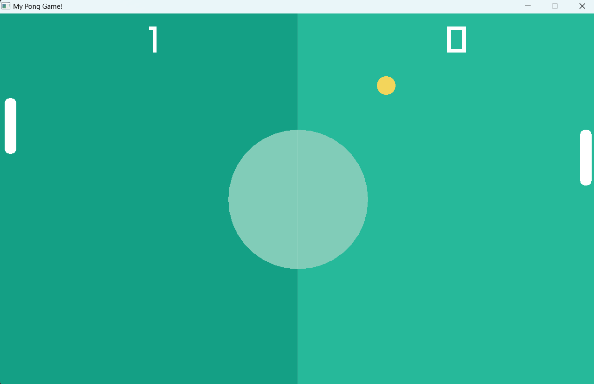

# PingPong Game
This is a classic Pong game developed in C++ using the Raylib library. The project offers a fun and engaging gameplay experience where two players can compete, or a player can face off against an AI-controlled opponent.



## Features
- Player vs CPU mode
- Smooth ball physics and responsive movement
- Accurate collision detection between the ball and paddles
- Score tracking for both the player and opponent
- Boost Mode: Click 'B' for temperory boost in speed
## Requirements
- C++ compiler (supporting C++11 or later)
- Raylib library installed in C Drive
## Installation

Although I have included the final executable file main.exe, if you want to build it by yourself you can do so by following steps-

1. Clone the repository:
```shell
git clone https://github.com/tars-06/ping-pong-game.git
```
2. Move to the directory in a terminal where main.cpp is stored.

3. Build the game using your C++ compiler. Personally, I have used mingw32-make as follows: 
```shell
mingw32-make main
```
3. Run the executable available in the build folder. Run the following command:
```shell
./main
```
## Acknowledgments
- The Raylib library for providing an easy-to-use framework for game development.
